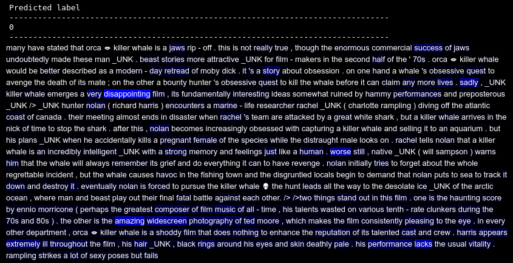

# Anuvada: Interpretable Models for NLP using PyTorch

One of the common criticisms of deep learning has been it's black box nature. To address this issue, researchers have
developed many ways to visualise and explain the inference. Self-explainable models are necessary to push deep learning
models into various domains. This library is an ongoing effort to provide a high-level access to
such models by building on top of PyTorch. Here is what you can expect to visualize from a trained model.



## Installing

Clone this repo and add it to your python library path.

* [PyTorch](http://pytorch.org)
* [NumPy](http://numpy.org/)
* [Pandas](http://pandas.pydata.org/)
* [Spacy](https://spacy.io/)

### Getting started

### Importing libraries


```python
import anuvada
import numpy as np
import torch
import pandas as pd
```


```python
from anuvada.models.classification_attention_rnn import AttentionClassifier
```

### Creating the dataset


```python
from anuvada.datasets.data_loader import CreateDataset
from anuvada.datasets.data_loader import LoadData
```


```python
data = CreateDataset()
```


```python
df = pd.read_csv('MovieSummaries/movie_summary_filtered.csv')
```


```python
# passing only the first 512 samples, I don't have a GPU!
y = list(df.Genre.values)[0:512]
x = list(df.summary.values)[0:512]
```


```python
x, y = data.create_dataset(x,y, folder_path='test', max_doc_tokens=500)
```

### Loading created dataset


```python
l = LoadData()
```


```python
x, y, token2id, label2id, lengths_mask = l.load_data_from_path('test')
```

### Change into torch vectors


```python
x = torch.from_numpy(x)
```


```python
y = torch.from_numpy(y)
```

### Create attention classifier


```python
acf = AttentionClassifier(vocab_size=len(token2id)+2,embed_size=25,gru_hidden=25,n_classes=len(label2id))
```


```python
loss = acf.fit(x,y, lengths_mask ,epochs=5, validation_split=0.2)
```

    Epoch 1 / 5
    [========================================] 100%	loss: 3.9904loss: 3.9904

    Epoch 2 / 5
    [========================================] 100%	loss: 3.9851loss: 3.9851

    Epoch 3 / 5
    [========================================] 100%	loss: 3.9783loss: 3.9783

    Epoch 4 / 5
    [========================================] 100%	loss: 3.9739loss: 3.9739

    Epoch 5 / 5
    [========================================] 100%	loss: 3.9650loss: 3.9650


## To do list

- [x] Implement Attention with RNN
- [x] Implement Attention Visualisation
- [x] Implement working Fit Module
- [x] Implement support for masking gradients in RNN (Working now!)
- [x] Implement a generic data set loader
- [ ] Implement CNN Classifier with feature map visualisation
- [x] Implement support for validation split
- [ ] Separate modules for CNN and RNN
- [x] Implement GPU Support
- [x] Implement support for custom loss function, learning rate tuning, custom metrics
- [x] Support for loading and saving models

## Acknowledgments

* https://github.com/henryre/pytorch-fitmodule